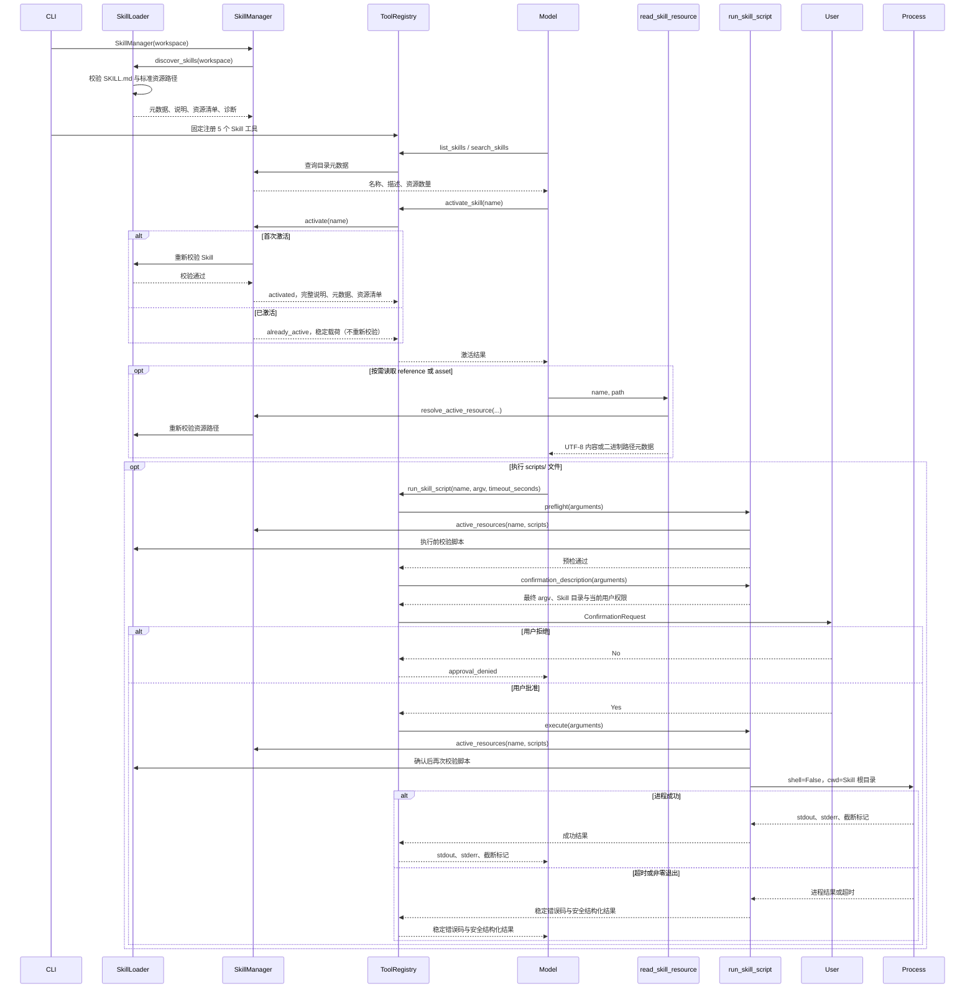

# Skill 调用时序图

```mermaid
sequenceDiagram
    participant CLI
    participant SL as SkillLoader
    participant SM as SkillManager
    participant R as ToolRegistry
    participant M as Model
    participant RR as read_skill_resource
    participant RS as run_skill_script
    participant U as User
    participant P as Process

    CLI->>SM: SkillManager(workspace)
    SM->>SL: discover_skills(workspace)
    SL->>SL: 校验 SKILL.md 与标准资源路径
    SL-->>SM: 元数据、说明、资源清单、诊断
    CLI->>R: 固定注册 5 个 Skill 工具

    M->>R: list_skills / search_skills
    R->>SM: 查询目录元数据
    SM-->>M: 名称、描述、资源数量
    M->>R: activate_skill(name)
    R->>SM: activate(name)
    alt 首次激活
        SM->>SL: 重新校验 Skill
        SL-->>SM: 校验通过
        SM-->>R: activated，完整说明、元数据、资源清单
    else 已激活
        SM-->>R: already_active，稳定载荷（不重新校验）
    end
    R-->>M: 激活结果
    opt 按需读取 reference 或 asset
        M->>RR: name, path
        RR->>SM: resolve_active_resource(...)
        SM->>SL: 重新校验资源路径
        RR-->>M: UTF-8 内容或二进制路径元数据
    end

    opt 执行 scripts/ 文件
        M->>R: run_skill_script(name, argv, timeout_seconds)
        R->>RS: preflight(arguments)
        RS->>SM: active_resources(name, scripts)
        RS->>SL: 执行前校验脚本
        RS-->>R: 预检通过
        R->>RS: confirmation_description(arguments)
        RS-->>R: 最终 argv、Skill 目录与当前用户权限
        R->>U: ConfirmationRequest
        alt 用户拒绝
            U-->>R: No
            R-->>M: approval_denied
        else 用户批准
            U-->>R: Yes
            R->>RS: execute(arguments)
            RS->>SM: active_resources(name, scripts)
            RS->>SL: 确认后再次校验脚本
            RS->>P: shell=False，cwd=Skill 根目录
            alt 进程成功
                P-->>RS: stdout、stderr、截断标记
                RS-->>R: 成功结果
                R-->>M: stdout、stderr、截断标记
            else 超时或非零退出
                P-->>RS: 进程结果或超时
                RS-->>R: 稳定错误码与安全结构化结果
                R-->>M: 稳定错误码与安全结构化结果
            end
        end
    end
```
