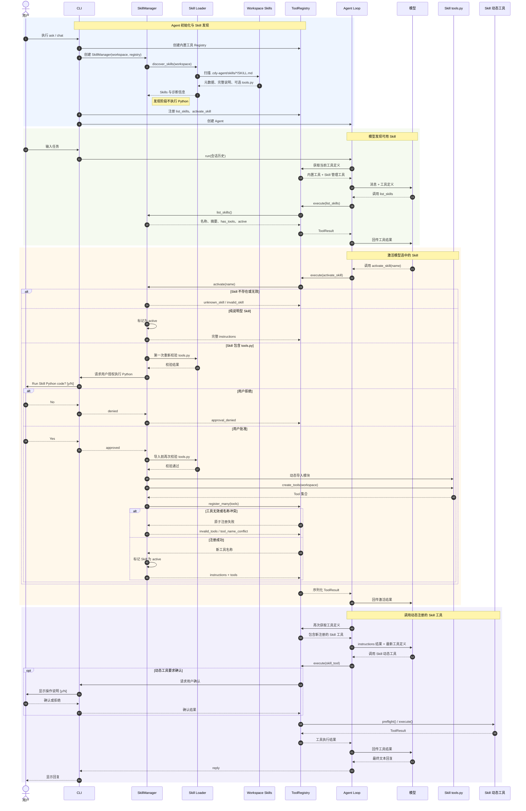

```mermaid
  sequenceDiagram
      autonumber

      actor U as 用户
      participant CLI as CLI
      participant SM as SkillManager
      participant SL as Skill Loader
      participant FS as Workspace Skills
      participant R as ToolRegistry
      participant A as Agent Loop
      participant M as 模型
      participant ST as Skill tools.py
      participant T as Skill 动态工具

      rect rgb(238, 245, 255)
          Note over CLI,R: Agent 初始化与 Skill 发现
          U->>CLI: 执行 ask / chat
          CLI->>R: 创建内置工具 Registry
          CLI->>SM: 创建 SkillManager(workspace, registry)
          SM->>SL: discover_skills(workspace)
          SL->>FS: 扫描 .cdy-agent/skills/*/SKILL.md
          FS-->>SL: 元数据、完整说明、可选 tools.py
          SL-->>SM: Skills 与诊断信息
          Note right of SM: 发现阶段不执行 Python
          CLI->>R: 注册 list_skills、activate_skill
          CLI->>A: 创建 Agent
      end

      rect rgb(245, 250, 240)
          Note over A,M: 模型发现可用 Skill
          U->>CLI: 输入任务
          CLI->>A: run(会话历史)
          A->>R: 获取当前工具定义
          R-->>A: 内置工具 + Skill 管理工具
          A->>M: 消息 + 工具定义
          M-->>A: 调用 list_skills
          A->>R: execute(list_skills)
          R->>SM: list_skills()
          SM-->>R: 名称、摘要、has_tools、active
          R-->>A: ToolResult
          A->>M: 回传工具结果
      end

      rect rgb(255, 248, 235)
          Note over A,ST: 激活模型选中的 Skill
          M-->>A: 调用 activate_skill(name)
          A->>R: execute(activate_skill)
          R->>SM: activate(name)

          alt Skill 不存在或无效
              SM-->>R: unknown_skill / invalid_skill
          else 纯说明型 Skill
              SM->>SM: 标记为 active
              SM-->>R: 完整 instructions
          else Skill 包含 tools.py
              SM->>SL: 第一次重新校验 tools.py
              SL-->>SM: 校验结果
              SM->>CLI: 请求用户授权执行 Python
              CLI->>U: Run Skill Python code? [y/N]

              alt 用户拒绝
                  U-->>CLI: No
                  CLI-->>SM: denied
                  SM-->>R: approval_denied
              else 用户批准
                  U-->>CLI: Yes
                  CLI-->>SM: approved
                  SM->>SL: 导入前再次校验 tools.py
                  SL-->>SM: 校验通过
                  SM->>ST: 动态导入模块
                  SM->>ST: create_tools(workspace)
                  ST-->>SM: Tool 集合
                  SM->>R: register_many(tools)

                  alt 工具无效或名称冲突
                      R-->>SM: 原子注册失败
                      SM-->>R: invalid_tools / tool_name_conflict
                  else 注册成功
                      R-->>SM: 新工具名称
                      SM->>SM: 标记 Skill 为 active
                      SM-->>R: instructions + tools
                  end
              end
          end

          R-->>A: 序列化 ToolResult
          A->>M: 回传激活结果
      end

      rect rgb(242, 240, 252)
          Note over A,T: 调用动态注册的 Skill 工具
          A->>R: 再次获取工具定义
          R-->>A: 包含新注册的 Skill 工具
          A->>M: instructions 结果 + 最新工具定义
          M-->>A: 调用 Skill 动态工具
          A->>R: execute(skill_tool)
          opt 动态工具要求确认
              R->>CLI: 请求用户确认
              CLI->>U: 显示操作说明 [y/N]
              U-->>CLI: 确认或拒绝
              CLI-->>R: 确认结果
          end
          R->>T: preflight() / execute()
          T-->>R: ToolResult
          R-->>A: 工具执行结果
          A->>M: 回传工具结果
          M-->>A: 最终文本回复
          A-->>CLI: reply
          CLI-->>U: 显示回复
      end
```