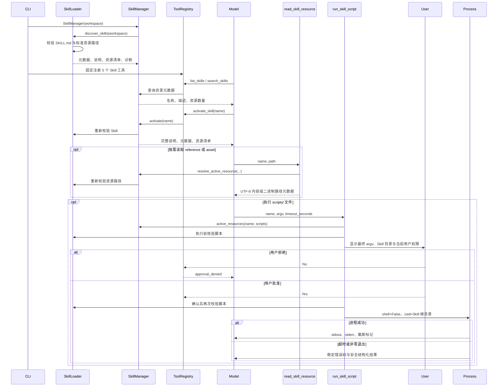

# Standard Agent Skills Refactor Implementation Plan

> **For agentic workers:** REQUIRED SUB-SKILL: Use superpowers:subagent-driven-development (recommended) or superpowers:executing-plans to implement this plan task-by-task. Steps use checkbox (`- [ ]`) syntax for tracking.

**Goal:** Replace the proprietary root `tools.py` Skill extension with strict standard Agent Skills metadata, progressive resource loading, and confirmed execution of arbitrary-runtime scripts.

**Architecture:** `skills.loader` strictly discovers `SKILL.md` plus the three standard resource trees, `skills.manager` owns the catalog and activation state, and five fixed tools expose catalog, activation, resource reads, and script execution. Script processes reuse shared environment/output helpers without widening the ordinary shell allowlist or dynamically mutating the registry.

**Tech Stack:** Python 3.10+, dataclasses, pathlib, PyYAML, subprocess, Typer, pytest, uv

## Global Constraints

- Discover Skills only from `<workspace>/.cdy-agent/skills/<skill-name>/`.
- Do not scan `.agents/skills/`, user-level Skill directories, or ancestor
  workspaces.
- Remove root-level `tools.py` and `create_tools(workspace)` support without a compatibility layer.
- Recognize only `scripts/`, `references/`, and `assets/`; ignore other Skill-root entries.
- Validate the official Agent Skills frontmatter strictly, including rejecting unknown and duplicate fields.
- Allow any installed script runtime, execute with `shell=False`, and ask for confirmation on every script call.
- Never treat `allowed-tools` as permission to bypass CDY Agent confirmation.
- Do not install script runtimes or dependencies and do not claim process sandboxing.
- Keep all tests offline and independent of real provider credentials, network access, and contributor filesystem state.
- Preserve user-owned `.idea/` and `debug_cli.py` as untracked files.

---

## File Map

- Create `src/cdy_agent/tools/process.py`: shared process environment sanitization and UTF-8 byte-limited output.
- Modify `src/cdy_agent/tools/base.py`: allow failed tool results to carry safe structured process details.
- Modify `src/cdy_agent/tools/shell.py`: consume shared process helpers with no behavior change.
- Modify `src/cdy_agent/skills/models.py`: standard metadata and categorized resource records.
- Replace `src/cdy_agent/skills/loader.py`: strict frontmatter parsing, resource discovery, and target revalidation.
- Replace `src/cdy_agent/skills/manager.py`: catalog, activation, resource counts, and activated-resource resolution.
- Replace `src/cdy_agent/skills/tools.py`: five fixed tools and confirmed script runtime.
- Modify `src/cdy_agent/cli.py`: construct the simplified manager and register five tools once.
- Modify `tests/test_tool_registry.py`: failed-result detail serialization regression.
- Modify `tests/test_shell_tool.py`: shared-helper behavior regression.
- Replace `tests/test_skill_loader.py`: standard format and filesystem-safety coverage.
- Replace `tests/test_skill_manager.py`: catalog, activation, and resource-resolution coverage.
- Replace `tests/test_skill_tools.py`: resource reading and script execution coverage.
- Modify `tests/test_cli.py`: five-tool integration and confirmation copy.
- Modify `README.md`: standard Skill authoring, migration, runtime, and security documentation.
- Modify `docs/SKILL调用时序图.md`: progressive disclosure and per-script confirmation sequence.

### Task 1: Structured Process Results and Shared Process Helpers

**Files:**
- Create: `src/cdy_agent/tools/process.py`
- Modify: `src/cdy_agent/tools/base.py`
- Modify: `src/cdy_agent/tools/shell.py`
- Modify: `tests/test_tool_registry.py`
- Modify: `tests/test_shell_tool.py`

**Interfaces:**
- Produces: `ToolResult.failure(code: str, message: str, data: Any = None) -> ToolResult`
- Produces: `sanitized_environment() -> dict[str, str]`
- Produces: `limited_output(output: str, limit: int = MAX_OUTPUT_BYTES) -> tuple[str, bool]`
- Preserves: all existing `ShellTool` behavior and `MAX_OUTPUT_BYTES` import compatibility.

- [ ] **Step 1: Write failing structured-failure serialization tests**

Append to `tests/test_tool_registry.py`:

```python
def test_failed_tool_result_serializes_optional_structured_data() -> None:
    result = ToolResult.failure(
        "script_failed",
        "Script exited with return code 2.",
        {"returncode": 2, "stdout": "out", "stderr": "err"},
    )

    assert json.loads(result.to_json()) == {
        "ok": False,
        "error": {
            "code": "script_failed",
            "message": "Script exited with return code 2.",
            "data": {"returncode": 2, "stdout": "out", "stderr": "err"},
        },
    }


def test_failed_tool_result_omits_absent_structured_data() -> None:
    result = ToolResult.failure("failed", "No details.")

    assert json.loads(result.to_json()) == {
        "ok": False,
        "error": {"code": "failed", "message": "No details."},
    }
```

Ensure the file imports `json` and `ToolResult`.

- [ ] **Step 2: Run the new tests and verify RED**

Run:

```powershell
uv run pytest tests/test_tool_registry.py::test_failed_tool_result_serializes_optional_structured_data tests/test_tool_registry.py::test_failed_tool_result_omits_absent_structured_data -v
```

Expected: the first test fails because `ToolResult.failure` accepts only
`code` and `message`; the second remains green.

- [ ] **Step 3: Add optional failure data without changing existing JSON**

Change `ToolResult.failure` and `to_json` in `src/cdy_agent/tools/base.py`:

```python
    @classmethod
    def failure(
        cls, code: str, message: str, data: Any = None
    ) -> "ToolResult":
        return cls(ok=False, data=data, code=code, message=message)

    def to_json(self) -> str:
        if self.ok:
            value = {"ok": True, "data": self.data}
        else:
            error = {"code": self.code, "message": self.message}
            if self.data is not None:
                error["data"] = self.data
            value = {"ok": False, "error": error}
        return json.dumps(value, ensure_ascii=False)
```

- [ ] **Step 4: Run the structured-result tests and verify GREEN**

Run:

```powershell
uv run pytest tests/test_tool_registry.py -v
```

Expected: all registry tests pass.

- [ ] **Step 5: Write a failing regression for shared process helpers**

Append to `tests/test_shell_tool.py`:

```python
from cdy_agent.tools.process import limited_output, sanitized_environment


def test_process_helpers_sanitize_environment_and_limit_utf8_bytes(
    monkeypatch: pytest.MonkeyPatch,
) -> None:
    monkeypatch.setenv("GIT_EXTERNAL_DIFF", "unsafe")
    monkeypatch.setenv("RIPGREP_CONFIG_PATH", "unsafe")

    environment = sanitized_environment()
    output, truncated = limited_output("a" * 4 + "你", limit=5)

    assert environment["GIT_PAGER"] == "cat"
    assert environment["PAGER"] == "cat"
    assert "GIT_EXTERNAL_DIFF" not in environment
    assert "RIPGREP_CONFIG_PATH" not in environment
    assert output == "a" * 4
    assert truncated is True
```

- [ ] **Step 6: Run the helper test and verify RED**

Run:

```powershell
uv run pytest tests/test_shell_tool.py::test_process_helpers_sanitize_environment_and_limit_utf8_bytes -v
```

Expected: collection fails because `cdy_agent.tools.process` does not exist.

- [ ] **Step 7: Create the shared process helper and refactor shell imports**

Create `src/cdy_agent/tools/process.py`:

```python
from __future__ import annotations

import os

MAX_OUTPUT_BYTES = 64 * 1024


def sanitized_environment() -> dict[str, str]:
    environment = dict(os.environ)
    environment.pop("GIT_EXTERNAL_DIFF", None)
    environment.pop("RIPGREP_CONFIG_PATH", None)
    environment.update({"GIT_PAGER": "cat", "PAGER": "cat"})
    return environment


def limited_output(
    output: str, limit: int = MAX_OUTPUT_BYTES
) -> tuple[str, bool]:
    encoded = output.encode("utf-8")
    if len(encoded) <= limit:
        return output, False
    limited = encoded[:limit]
    return limited.decode("utf-8", errors="ignore"), True
```

In `src/cdy_agent/tools/shell.py`, remove the `os` import and the local
`_sanitized_environment`, `_limited_output`, and `MAX_OUTPUT_BYTES`
definitions. Import and use:

```python
from cdy_agent.tools.process import (
    MAX_OUTPUT_BYTES,
    limited_output,
    sanitized_environment,
)
```

Keep this compatibility alias:

```python
MAX_OUTPUT_CHARS = MAX_OUTPUT_BYTES
```

Replace `_sanitized_environment()` with `sanitized_environment()` and
`_limited_output(...)` with `limited_output(...)`.

- [ ] **Step 8: Run focused and full helper regressions**

Run:

```powershell
uv run pytest tests/test_tool_registry.py tests/test_shell_tool.py -v
```

Expected: all tests pass with existing shell behavior unchanged.

- [ ] **Step 9: Commit the process primitives**

```powershell
git add src/cdy_agent/tools/base.py src/cdy_agent/tools/process.py src/cdy_agent/tools/shell.py tests/test_tool_registry.py tests/test_shell_tool.py
git commit -m "Add shared process result helpers"
```

### Task 2: Strict Standard Skill Discovery

**Files:**
- Replace: `src/cdy_agent/skills/models.py`
- Replace: `src/cdy_agent/skills/loader.py`
- Replace: `tests/test_skill_loader.py`

**Interfaces:**
- Produces: `SkillMetadata(name, description, license, compatibility, metadata, allowed_tools)`
- Produces: `SkillResource(category, relative_path, path, size)`
- Produces: `discover_skills(workspace: Path) -> SkillDiscovery`
- Produces: `revalidate_skill(skill: DiscoveredSkill, workspace: Path) -> None`
- Produces: `revalidate_resource(skill, resource, workspace, expected_category=None) -> Path`
- Removes: `tools_path`, `has_tools`, `MAX_TOOLS_BYTES`, and `revalidate_tools_file`.

- [ ] **Step 1: Replace loader tests with standard frontmatter expectations**

Start `tests/test_skill_loader.py` with:

```python
import os
import shutil
from pathlib import Path

import pytest

from cdy_agent.skills.loader import (
    MAX_RESOURCES,
    InvalidSkillError,
    discover_skills,
    revalidate_resource,
)


def write_skill(
    root: Path,
    name: str = "sample-skill",
    *,
    frontmatter: str | None = None,
    body: str = "# Instructions",
) -> Path:
    directory = root / ".cdy-agent" / "skills" / name
    directory.mkdir(parents=True)
    metadata = frontmatter or (
        f"name: {name}\n"
        f"description: Use {name} for matching tasks.\n"
    )
    (directory / "SKILL.md").write_text(
        f"---\n{metadata}---\n\n{body}\n",
        encoding="utf-8",
    )
    return directory
```

Add these exact behavior tests:

```python
def test_missing_skills_directory_is_empty_and_not_created(tmp_path: Path) -> None:
    discovery = discover_skills(tmp_path)
    assert discovery.skills == ()
    assert discovery.diagnostics == ()
    assert not (tmp_path / ".cdy-agent").exists()


def test_parses_all_standard_metadata_fields(tmp_path: Path) -> None:
    write_skill(
        tmp_path,
        "pdf-processing",
        frontmatter=(
            "name: pdf-processing\n"
            "description: Process PDFs when users request document extraction.\n"
            "license: Apache-2.0\n"
            "compatibility: Requires Python 3.10+ and network access\n"
            "metadata:\n"
            "  author: example-org\n"
            '  version: "1.0"\n'
            "allowed-tools: Read Bash(git:*)\n"
        ),
    )

    skill = discover_skills(tmp_path).skills[0]

    assert skill.metadata.name == "pdf-processing"
    assert skill.metadata.license == "Apache-2.0"
    assert skill.metadata.compatibility == (
        "Requires Python 3.10+ and network access"
    )
    assert dict(skill.metadata.metadata) == {
        "author": "example-org",
        "version": "1.0",
    }
    assert skill.metadata.allowed_tools == "Read Bash(git:*)"
    assert skill.instructions == "# Instructions"


@pytest.mark.parametrize(
    ("name", "metadata"),
    [
        ("bad_name", "name: bad_name\ndescription: valid\n"),
        ("-bad", "name: -bad\ndescription: valid\n"),
        ("bad-", "name: bad-\ndescription: valid\n"),
        ("bad--name", "name: bad--name\ndescription: valid\n"),
        ("sample-skill", "name: other-name\ndescription: valid\n"),
        ("sample-skill", "name: sample-skill\ndescription: ''\n"),
        (
            "sample-skill",
            "name: sample-skill\ndescription: valid\nunknown: value\n",
        ),
        (
            "sample-skill",
            "name: sample-skill\ndescription: valid\nmetadata:\n  version: 1\n",
        ),
        (
            "sample-skill",
            "name: sample-skill\ndescription: valid\nallowed-tools: 1\n",
        ),
    ],
)
def test_rejects_nonstandard_frontmatter(
    tmp_path: Path, name: str, metadata: str
) -> None:
    write_skill(tmp_path, name, frontmatter=metadata)
    discovery = discover_skills(tmp_path)
    assert discovery.skills == ()
    assert discovery.diagnostics[0].code == "invalid_skill"


def test_rejects_duplicate_keys_and_empty_body(tmp_path: Path) -> None:
    write_skill(
        tmp_path,
        frontmatter=(
            "name: sample-skill\n"
            "name: sample-skill\n"
            "description: valid\n"
        ),
    )
    write_skill(tmp_path, "empty-body", body="   ")
    discovery = discover_skills(tmp_path)
    assert [item.entry for item in discovery.diagnostics] == [
        "empty-body",
        "sample-skill",
    ]
```

Retain the existing missing-root `OSError`, symlinked root, symlinked Skill
directory, symlinked `SKILL.md`, oversized `SKILL.md`, and valid-sibling
isolation tests, changing fixture names to hyphenated names.

- [ ] **Step 2: Run metadata tests and verify RED**

Run:

```powershell
uv run pytest tests/test_skill_loader.py -v
```

Expected: failures show underscore naming is still accepted, optional metadata
is rejected, and resource models do not exist.

- [ ] **Step 3: Implement standard model records**

Replace `src/cdy_agent/skills/models.py` with:

```python
from __future__ import annotations

from dataclasses import dataclass, field
from pathlib import Path
from types import MappingProxyType
from typing import Literal, Mapping

ResourceCategory = Literal["scripts", "references", "assets"]


@dataclass(frozen=True)
class SkillMetadata:
    name: str
    description: str
    license: str | None = None
    compatibility: str | None = None
    metadata: Mapping[str, str] = field(
        default_factory=lambda: MappingProxyType({})
    )
    allowed_tools: str | None = None


@dataclass(frozen=True)
class SkillResource:
    category: ResourceCategory
    relative_path: str
    path: Path
    size: int


@dataclass(frozen=True)
class DiscoveredSkill:
    metadata: SkillMetadata
    directory: Path
    instructions: str
    resources: tuple[SkillResource, ...]


@dataclass(frozen=True)
class SkillDiagnostic:
    entry: str
    code: str
    message: str


@dataclass(frozen=True)
class SkillDiscovery:
    skills: tuple[DiscoveredSkill, ...]
    diagnostics: tuple[SkillDiagnostic, ...]
```

- [ ] **Step 4: Implement strict metadata parsing**

In `src/cdy_agent/skills/loader.py`, retain the duplicate-key SafeLoader and
workspace-root error isolation, then use these constants and validation shape:

```python
MAX_SKILL_BYTES = 256 * 1024
MAX_RESOURCES = 512
RESOURCE_CATEGORIES = ("scripts", "references", "assets")
NAME_PATTERN = re.compile(
    r"(?=.{1,64}\Z)[a-z0-9]+(?:-[a-z0-9]+)*\Z"
)
FRONTMATTER_FIELDS = {
    "name",
    "description",
    "license",
    "compatibility",
    "metadata",
    "allowed-tools",
}
```

Implement `_parse_skill` so it:

1. requires exact opening and closing `---`;
2. requires a mapping with exactly the two required fields and no unknown
   fields;
3. validates strings before stripping;
4. enforces 64/1024/500-character limits;
5. validates every metadata key and value as a string;
6. stores metadata with `MappingProxyType(dict(metadata))`;
7. maps YAML `allowed-tools` to `allowed_tools`; and
8. rejects an empty body.

Use stable messages such as `Skill name is invalid.`,
`Skill name must match its directory.`, `Skill description must be 1 to 1024
characters.`, `Skill metadata must map strings to strings.`, and
`Unknown Skill metadata fields are not allowed.`.

- [ ] **Step 5: Run metadata tests and verify GREEN**

Run:

```powershell
uv run pytest tests/test_skill_loader.py -k "metadata or frontmatter or body or missing" -v
```

Expected: selected tests pass.

- [ ] **Step 6: Add failing resource discovery and revalidation tests**

Add to `tests/test_skill_loader.py`:

```python
def test_discovers_only_standard_resources_recursively_in_stable_order(
    tmp_path: Path,
) -> None:
    directory = write_skill(tmp_path)
    files = {
        "scripts/z.py": "print('z')",
        "scripts/nested/a.sh": "exit 0",
        "references/guide.md": "# Guide",
        "assets/template.txt": "template",
        "custom/ignored.txt": "ignored",
        "tools.py": "raise RuntimeError('must stay inert')",
    }
    for relative, content in files.items():
        target = directory / relative
        target.parent.mkdir(parents=True, exist_ok=True)
        target.write_text(content, encoding="utf-8")

    skill = discover_skills(tmp_path).skills[0]

    assert [
        (item.category, item.relative_path, item.size)
        for item in skill.resources
    ] == [
        ("assets", "assets/template.txt", len("template")),
        ("references", "references/guide.md", len("# Guide")),
        ("scripts", "scripts/nested/a.sh", len("exit 0")),
        ("scripts", "scripts/z.py", len("print('z')")),
    ]


def test_rejects_too_many_resources(tmp_path: Path) -> None:
    directory = write_skill(tmp_path)
    scripts = directory / "scripts"
    scripts.mkdir()
    for index in range(MAX_RESOURCES + 1):
        (scripts / f"{index:04}.py").write_text("", encoding="utf-8")

    discovery = discover_skills(tmp_path)

    assert discovery.skills == ()
    assert "more than 512 resources" in discovery.diagnostics[0].message


@pytest.mark.skipif(
    not hasattr(os, "symlink"), reason="symbolic links are unavailable"
)
def test_rejects_symlinks_inside_standard_resource_trees(tmp_path: Path) -> None:
    directory = write_skill(tmp_path)
    references = directory / "references"
    references.mkdir()
    outside = tmp_path / "outside.md"
    outside.write_text("secret", encoding="utf-8")
    os.symlink(outside, references / "linked.md")

    discovery = discover_skills(tmp_path)

    assert discovery.skills == ()
    assert "symbolic links" in discovery.diagnostics[0].message


def test_revalidate_rejects_removed_or_replaced_resource(tmp_path: Path) -> None:
    directory = write_skill(tmp_path)
    script = directory / "scripts" / "run.py"
    script.parent.mkdir()
    script.write_text("print('ok')", encoding="utf-8")
    skill = discover_skills(tmp_path).skills[0]
    resource = skill.resources[0]
    script.unlink()
    script.mkdir()

    with pytest.raises(InvalidSkillError, match="regular file"):
        revalidate_resource(skill, resource, tmp_path)
```

Also retain the current workspace-replacement test but apply it to a discovered
resource and `revalidate_resource`.

- [ ] **Step 7: Run resource tests and verify RED**

Run:

```powershell
uv run pytest tests/test_skill_loader.py -k "resource or symlink or discovers_only" -v
```

Expected: failures show resources are not scanned or revalidated.

- [ ] **Step 8: Implement bounded resource discovery and revalidation**

Add `_discover_resources(directory, workspace)` which walks only recognized
directories without following symlinks, calls `_require_safe` for every
directory and file, rejects non-regular entries, counts no more than
`MAX_RESOURCES`, and builds `SkillResource` records with:

```python
relative_path = path.relative_to(directory).as_posix()
```

Return resources sorted by `(resource.category, resource.relative_path)`.

Implement:

```python
def revalidate_skill(skill: DiscoveredSkill, workspace: Path) -> None:
    try:
        resolved_workspace = resolve_workspace(workspace)
    except ValueError as error:
        raise InvalidSkillError("Workspace is invalid.") from error
    _require_safe(skill.directory, resolved_workspace, directory=True)
    skill_file = skill.directory / "SKILL.md"
    _require_safe(skill_file, resolved_workspace, directory=False)
    if skill_file.stat().st_size > MAX_SKILL_BYTES:
        raise InvalidSkillError("SKILL.md exceeds 256 KiB.")


def revalidate_resource(
    skill: DiscoveredSkill,
    resource: SkillResource,
    workspace: Path,
    *,
    expected_category: ResourceCategory | None = None,
) -> Path:
```

The function must resolve the workspace, optionally enforce the category,
revalidate the Skill directory and resource path with `_require_safe`, prove
the target remains under `skill.directory / resource.category`, and return the
resolved regular file. Map an invalid workspace to
`InvalidSkillError("Workspace is invalid.")`.

- [ ] **Step 9: Run loader tests and verify GREEN**

Run:

```powershell
uv run pytest tests/test_skill_loader.py -v
```

Expected: all loader tests pass.

- [ ] **Step 10: Commit strict discovery**

```powershell
git add src/cdy_agent/skills/models.py src/cdy_agent/skills/loader.py tests/test_skill_loader.py
git commit -m "Discover standard Skill resources"
```

### Task 3: Catalog, Activation, and Resource Resolution

**Files:**
- Replace: `src/cdy_agent/skills/manager.py`
- Replace: `tests/test_skill_manager.py`

**Interfaces:**
- Produces: `SkillManager(workspace: Path)`
- Produces: `activate(name: str) -> ToolResult`
- Produces: `active_resources(name, categories) -> tuple[SkillResource, ...] | ToolResult`
- Produces: `resolve_active_resource(name, path, categories) -> SkillResource | ToolResult`
- Removes: registry and confirmation constructor dependencies, module imports, and dynamic tool registration.

- [ ] **Step 1: Write the new manager fixture and failing catalog tests**

Start `tests/test_skill_manager.py` with:

```python
from pathlib import Path

from cdy_agent.skills.manager import SkillManager


def write_skill(tmp_path: Path, name: str = "content-summary") -> Path:
    directory = tmp_path / ".cdy-agent" / "skills" / name
    directory.mkdir(parents=True)
    (directory / "SKILL.md").write_text(
        (
            "---\n"
            f"name: {name}\n"
            f"description: Use {name} for matching tasks.\n"
            "license: Apache-2.0\n"
            "metadata:\n"
            '  version: "1.0"\n'
            "allowed-tools: Read Bash(git:*)\n"
            "---\n\n"
            f"# {name}\n"
        ),
        encoding="utf-8",
    )
    return directory
```

Add:

```python
def test_list_and_search_report_resource_counts(tmp_path: Path) -> None:
    directory = write_skill(tmp_path)
    for relative in (
        "scripts/run.py",
        "references/guide.md",
        "assets/a.txt",
        "assets/b.txt",
    ):
        target = directory / relative
        target.parent.mkdir(parents=True, exist_ok=True)
        target.write_text(relative, encoding="utf-8")

    manager = SkillManager(tmp_path)
    listing = manager.list_skills()["skills"][0]
    match = manager.search_skills("matching tasks")["matches"][0]

    expected = {"scripts": 1, "references": 1, "assets": 2}
    assert listing["resource_counts"] == expected
    assert match["resource_counts"] == expected
    assert listing["active"] is False
    assert "has_tools" not in listing


def test_activation_returns_metadata_manifest_and_is_idempotent(
    tmp_path: Path,
) -> None:
    directory = write_skill(tmp_path)
    reference = directory / "references" / "guide.md"
    reference.parent.mkdir()
    reference.write_text("# Guide", encoding="utf-8")
    manager = SkillManager(tmp_path)

    first = manager.activate("content-summary")
    second = manager.activate("content-summary")

    assert first.ok
    assert first.data["status"] == "activated"
    assert second.data["status"] == "already_active"
    assert first.data["metadata"] == {
        "name": "content-summary",
        "description": "Use content-summary for matching tasks.",
        "license": "Apache-2.0",
        "compatibility": None,
        "metadata": {"version": "1.0"},
        "allowed-tools": "Read Bash(git:*)",
    }
    assert first.data["directory"] == str(directory.resolve())
    assert first.data["relative_paths"] == (
        "Resolve resource paths from the Skill directory."
    )
    assert first.data["resources"] == [
        {
            "category": "references",
            "path": "references/guide.md",
            "size": len("# Guide"),
        }
    ]
```

- [ ] **Step 2: Run manager tests and verify RED**

Run:

```powershell
uv run pytest tests/test_skill_manager.py -v
```

Expected: construction fails because the current manager requires registry and
confirmation arguments.

- [ ] **Step 3: Replace dynamic loading with pure catalog management**

Replace `SkillManager.__init__` with:

```python
def __init__(self, workspace: Path) -> None:
    self.workspace = workspace.resolve()
    discovery = discover_skills(self.workspace)
    self._skills = {
        skill.metadata.name: skill for skill in discovery.skills
    }
    self._diagnostics = discovery.diagnostics
    self._active: set[str] = set()
```

Add helpers `_resource_counts`, `_metadata_payload`, `_resource_payload`, and
`_activation_payload`. Preserve tokenization and ranking functions, changing
underscore replacement to direct hyphen-to-space normalization:

```python
name_text = skill.metadata.name.replace("-", " ").lower()
```

Activation must revalidate `SKILL.md` and its directory before marking active.
Use the loader's `revalidate_skill(skill, self.workspace)` helper rather than
duplicating path validation.
If revalidation fails, return:

```python
ToolResult.failure(
    "invalid_skill",
    f"Skill '{skill.metadata.name}' changed or is invalid.",
)
```

Unknown names retain `invalid_skill` for diagnosed entries and `unknown_skill`
for absent entries.

- [ ] **Step 4: Run catalog and activation tests and verify GREEN**

Run:

```powershell
uv run pytest tests/test_skill_manager.py -k "list or search or activation" -v
```

Expected: selected tests pass with no Registry mutation.

- [ ] **Step 5: Write failing active-resource resolution tests**

Add:

```python
def test_active_resources_requires_activation_and_filters_categories(
    tmp_path: Path,
) -> None:
    directory = write_skill(tmp_path)
    for relative in ("scripts/run.py", "references/guide.md"):
        target = directory / relative
        target.parent.mkdir(parents=True, exist_ok=True)
        target.write_text(relative, encoding="utf-8")
    manager = SkillManager(tmp_path)

    inactive = manager.active_resources("content-summary", ("scripts",))
    assert inactive.code == "skill_not_active"

    manager.activate("content-summary")
    scripts = manager.active_resources("content-summary", ("scripts",))
    assert [item.relative_path for item in scripts] == ["scripts/run.py"]


def test_resolve_active_resource_enforces_activation_and_category(
    tmp_path: Path,
) -> None:
    directory = write_skill(tmp_path)
    reference = directory / "references" / "guide.md"
    reference.parent.mkdir()
    reference.write_text("# Guide", encoding="utf-8")
    manager = SkillManager(tmp_path)

    inactive = manager.resolve_active_resource(
        "content-summary", "references/guide.md", ("references", "assets")
    )
    assert inactive.code == "skill_not_active"

    assert manager.activate("content-summary").ok
    resolved = manager.resolve_active_resource(
        "content-summary", "references/guide.md", ("references", "assets")
    )
    wrong_category = manager.resolve_active_resource(
        "content-summary", "references/guide.md", ("scripts",)
    )
    unknown = manager.resolve_active_resource(
        "content-summary", "../SKILL.md", ("references", "assets")
    )

    assert resolved.relative_path == "references/guide.md"
    assert wrong_category.code == "wrong_resource_category"
    assert unknown.code == "unknown_resource"
```

Add a regression that replaces the resource with a symlink or directory after
activation and expects `invalid_resource`.

- [ ] **Step 6: Run resolution tests and verify RED**

Run:

```powershell
uv run pytest tests/test_skill_manager.py -k "resolve_active" -v
```

Expected: failure because `resolve_active_resource` does not exist.

- [ ] **Step 7: Implement exact activated-resource resolution**

Implement:

```python
def active_resources(
    self,
    name: str,
    categories: tuple[ResourceCategory, ...],
) -> tuple[SkillResource, ...] | ToolResult:
```

It must resolve unknown/diagnosed Skill identity, require activation, and
return only resources whose category is in `categories`, preserving discovery
order. This is the script tool's safe way to find exact manifest paths without
accessing manager internals.

Then implement:

```python
def resolve_active_resource(
    self,
    name: str,
    path: str,
    categories: tuple[ResourceCategory, ...],
) -> SkillResource | ToolResult:
```

The method must:

1. return diagnosed/unknown Skill identity using the same public codes as
   activation;
2. require `name in self._active`;
3. find resources by exact `relative_path`, without normalizing caller input;
4. return `wrong_resource_category` when the exact resource exists outside the
   requested categories;
5. call `revalidate_resource` and map any filesystem validation failure to
   `invalid_resource`; and
6. return the original immutable `SkillResource` on success.

- [ ] **Step 8: Run all manager tests and verify GREEN**

Run:

```powershell
uv run pytest tests/test_skill_manager.py -v
```

Expected: all manager tests pass.

- [ ] **Step 9: Commit the pure manager**

```powershell
git add src/cdy_agent/skills/manager.py tests/test_skill_manager.py
git commit -m "Manage standard Skill activation"
```

### Task 4: On-demand Resources and Confirmed Script Execution

**Files:**
- Replace: `src/cdy_agent/skills/tools.py`
- Replace: `tests/test_skill_tools.py`

**Interfaces:**
- Produces: `ReadSkillResourceTool(manager)`
- Produces: `RunSkillScriptTool(manager, runner=subprocess.run)`
- Produces: `create_skill_tools(manager) -> tuple` in stable five-tool order.
- Consumes: `SkillManager.active_resources` and
  `SkillManager.resolve_active_resource`.

- [ ] **Step 1: Update the fake manager and write failing schema tests**

Start `tests/test_skill_tools.py` with imports for `subprocess`, `Path`,
`SimpleNamespace`, `pytest`, all five tool classes, `SkillResource`,
`ToolCall`, `ToolResult`, and `ToolRegistry`.

Define:

```python
class FakeManager:
    workspace = Path("/workspace")

    def list_skills(self) -> dict[str, list[object]]:
        return {"skills": [], "diagnostics": []}

    def search_skills(self, query: str, limit: int) -> dict[str, object]:
        return {"query": query, "limit": limit, "matches": []}

    def activate(self, name: str) -> ToolResult:
        return ToolResult.success({"name": name})

    def resolve_active_resource(
        self,
        name: str,
        path: str,
        categories: tuple[str, ...],
    ) -> SkillResource | ToolResult:
        return ToolResult.failure("unknown_resource", "Unknown resource.")
```

Add:

```python
def test_skill_tool_factory_has_stable_five_tool_order() -> None:
    tools = create_skill_tools(FakeManager())
    assert [tool.name for tool in tools] == [
        "list_skills",
        "search_skills",
        "activate_skill",
        "read_skill_resource",
        "run_skill_script",
    ]
    assert [tool.requires_confirmation for tool in tools] == [
        False,
        False,
        False,
        False,
        True,
    ]


def test_resource_and_script_tools_expose_closed_schemas() -> None:
    manager = FakeManager()
    assert ReadSkillResourceTool(manager).parameters == {
        "type": "object",
        "properties": {
            "name": {"type": "string"},
            "path": {"type": "string"},
        },
        "required": ["name", "path"],
        "additionalProperties": False,
    }
    assert RunSkillScriptTool(manager).parameters == {
        "type": "object",
        "properties": {
            "name": {"type": "string"},
            "argv": {"type": "array", "items": {"type": "string"}},
            "timeout_seconds": {
                "type": "integer",
                "minimum": 1,
                "maximum": 300,
            },
        },
        "required": ["name", "argv"],
        "additionalProperties": False,
    }
```

Retain list/search/activate argument tests, changing valid Skill examples to
hyphenated names and using the new `NAME_PATTERN`.

- [ ] **Step 2: Run schema tests and verify RED**

Run:

```powershell
uv run pytest tests/test_skill_tools.py -k "factory or schemas" -v
```

Expected: failures because the two new classes do not exist and the factory
returns three tools.

- [ ] **Step 3: Add the two tool shells and stable factory order**

Implement both dataclasses with the exact schemas above. Update descriptions:

```python
ActivateSkillTool.description = (
    "Activate one workspace Skill and receive its instructions and resources."
)
ReadSkillResourceTool.description = (
    "Read one text reference or asset from an activated workspace Skill."
)
RunSkillScriptTool.description = (
    "Run one script from an activated workspace Skill after confirmation."
)
```

Use `requires_confirmation=False` for resource reads and
`requires_confirmation=True` as a non-init field for script execution. Return
the factory tuple in list, search, activate, read, run order.

- [ ] **Step 4: Write failing text and binary resource tests**

Use a real `SkillManager` and fixture directory:

```python
def write_runtime_skill(tmp_path: Path) -> tuple[SkillManager, Path]:
    directory = tmp_path / ".cdy-agent" / "skills" / "runtime-skill"
    directory.mkdir(parents=True)
    (directory / "SKILL.md").write_text(
        (
            "---\n"
            "name: runtime-skill\n"
            "description: Run and read test resources.\n"
            "---\n\n"
            "# Runtime\n"
        ),
        encoding="utf-8",
    )
    return SkillManager(tmp_path), directory


def test_read_skill_resource_returns_text_and_binary_metadata(
    tmp_path: Path,
) -> None:
    manager, directory = write_runtime_skill(tmp_path)
    reference = directory / "references" / "guide.md"
    asset = directory / "assets" / "image.bin"
    reference.parent.mkdir()
    asset.parent.mkdir()
    reference.write_text("# Guide", encoding="utf-8")
    asset.write_bytes(b"\xff\xfe")
    manager = SkillManager(tmp_path)
    manager.activate("runtime-skill")
    tool = ReadSkillResourceTool(manager)

    text = tool.execute(
        {"name": "runtime-skill", "path": "references/guide.md"}
    )
    binary = tool.execute(
        {"name": "runtime-skill", "path": "assets/image.bin"}
    )

    assert text.data["content"] == "# Guide"
    assert text.data["binary"] is False
    assert binary.data == {
        "path": str(asset.resolve()),
        "relative_path": "assets/image.bin",
        "size": 2,
        "binary": True,
    }
```

Add a test creating a UTF-8 reference larger than 1 MiB and expect
`resource_too_large`, plus tests for inactive and script-category manager
failures being preserved unchanged.

- [ ] **Step 5: Run resource tests and verify RED**

Run:

```powershell
uv run pytest tests/test_skill_tools.py -k "read_skill_resource" -v
```

Expected: failures because resource reading is not implemented.

- [ ] **Step 6: Implement bounded text-or-binary resource reads**

Set `MAX_RESOURCE_BYTES = 1024 * 1024`. `preflight` validates exact keys,
standard Skill name, and non-empty path, then calls manager resolution so
inactive/unknown/category errors occur before execution.

`execute` resolves again, reads at most `MAX_RESOURCE_BYTES + 1`, rejects
oversized content, attempts strict UTF-8 decoding, and returns the exact text
or binary payload specified in the test. Catch `OSError` as
`resource_read_failed` without traceback details.

- [ ] **Step 7: Run resource tests and verify GREEN**

Run:

```powershell
uv run pytest tests/test_skill_tools.py -k "read_skill_resource" -v
```

Expected: selected tests pass.

- [ ] **Step 8: Write failing script validation and execution tests**

Add tests using a fake `subprocess.run` runner:

```python
def test_run_skill_script_resolves_one_script_and_never_uses_shell(
    tmp_path: Path,
) -> None:
    manager, directory = write_runtime_skill(tmp_path)
    script = directory / "scripts" / "run.py"
    script.parent.mkdir()
    script.write_text("print('ok')", encoding="utf-8")
    manager = SkillManager(tmp_path)
    manager.activate("runtime-skill")
    calls: list[tuple[list[str], dict[str, object]]] = []

    def runner(
        argv: list[str], **kwargs: object
    ) -> subprocess.CompletedProcess[str]:
        calls.append((argv, kwargs))
        return subprocess.CompletedProcess(argv, 0, "ok", "")

    tool = RunSkillScriptTool(manager, runner=runner)
    result = tool.execute(
        {
            "name": "runtime-skill",
            "argv": ["uv", "run", "scripts/run.py", "--value", "x|y"],
            "timeout_seconds": 45,
        }
    )

    assert result.ok
    assert calls[0][0] == [
        "uv",
        "run",
        str(script.resolve()),
        "--value",
        "x|y",
    ]
    assert calls[0][1]["cwd"] == directory.resolve()
    assert calls[0][1]["shell"] is False
    assert calls[0][1]["timeout"] == 45


@pytest.mark.parametrize(
    "argv",
    [
        [],
        ["python", "-c", "print('no script')"],
        ["python", "scripts/a.py", "scripts/b.py"],
        ["python", 1],
    ],
)
def test_run_skill_script_rejects_invalid_script_commands(
    tmp_path: Path, argv: list[object]
) -> None:
    manager, directory = write_runtime_skill(tmp_path)
    scripts = directory / "scripts"
    scripts.mkdir()
    (scripts / "a.py").write_text("", encoding="utf-8")
    (scripts / "b.py").write_text("", encoding="utf-8")
    manager = SkillManager(tmp_path)
    manager.activate("runtime-skill")

    result = RunSkillScriptTool(manager).preflight(
        {"name": "runtime-skill", "argv": argv}
    )

    assert result is not None
    assert result.code in {"invalid_arguments", "invalid_script_command"}
```

Add focused tests for:

- a directly executable `["scripts/run.exe", "--flag"]` form;
- default timeout 30 and valid range 1–300;
- missing executable mapped to `execution_error`;
- `subprocess.TimeoutExpired` mapped to `script_timeout`;
- independent 64 KiB UTF-8 stdout/stderr truncation;
- non-zero exit mapped to `script_failed` with structured result data;
- confirmation text containing Skill name, resolved script, effective argv,
  working directory, and `current user permissions`;
- Registry denial returning `approval_denied` without calling the runner;
- Registry approval calling the runner every time, even when `SKILL.md`
  contains `allowed-tools`; and
- replacement after confirmation being caught by the second revalidation.

- [ ] **Step 9: Run script tests and verify RED**

Run:

```powershell
uv run pytest tests/test_skill_tools.py -k "run_skill_script or script_confirmation" -v
```

Expected: failures because script command preparation and execution are not
implemented.

- [ ] **Step 10: Implement exact script preparation**

Create a private immutable `_PreparedScript` containing Skill name, directory,
script path, effective argv, and timeout.

`RunSkillScriptTool.preflight` must:

1. validate exact keys, name, non-empty string argv, and timeout;
2. call `manager.active_resources(name, ("scripts",))`, preserve any manager
   failure, and build a mapping from exact manifest-relative paths;
3. resolve every argv element that exactly matches that mapping;
4. require exactly one match; and
5. cache nothing across Registry phases.

Use a `_prepare(arguments)` helper from preflight,
`confirmation_description`, and execute so every phase revalidates current
filesystem state. The description must use the prepared effective argv.

`execute` calls the injected runner with:

```python
runner(
    prepared.argv,
    cwd=prepared.directory,
    shell=False,
    capture_output=True,
    text=True,
    env=sanitized_environment(),
    timeout=prepared.timeout,
    check=False,
)
```

Use `limited_output` for stdout and stderr. Return structured success data for
exit zero. For non-zero exit, return:

```python
ToolResult.failure(
    "script_failed",
    f"Script exited with return code {completed.returncode}.",
    payload,
)
```

Catch `subprocess.TimeoutExpired` as `script_timeout` and `OSError` as
`execution_error`.

- [ ] **Step 11: Run all Skill tool tests and verify GREEN**

Run:

```powershell
uv run pytest tests/test_skill_tools.py -v
```

Expected: all five tool classes, reads, executions, and confirmation tests pass.

- [ ] **Step 12: Commit runtime tools**

```powershell
git add src/cdy_agent/skills/tools.py tests/test_skill_tools.py
git commit -m "Run standard Skill resources"
```

### Task 5: CLI Integration Without Dynamic Registry Mutation

**Files:**
- Modify: `src/cdy_agent/cli.py`
- Modify: `tests/test_cli.py`
- Modify: `tests/test_agent.py`

**Interfaces:**
- Consumes: `SkillManager(workspace)` and five fixed `create_skill_tools` results.
- Preserves: `Agent` registry definitions remain stable before and after Skill activation.

- [ ] **Step 1: Write failing five-tool CLI registration test**

Replace `test_create_agent_registers_skill_management_tools` with:

```python
def test_create_agent_registers_five_standard_skill_tools(
    monkeypatch: pytest.MonkeyPatch, tmp_path: Path
) -> None:
    monkeypatch.setattr(cli, "ModelGateway", lambda **kwargs: object())

    agent = cli._create_agent("model", "responses", tmp_path)

    names = [definition["name"] for definition in agent._registry.definitions]
    assert names[-5:] == [
        "list_skills",
        "search_skills",
        "activate_skill",
        "read_skill_resource",
        "run_skill_script",
    ]
```

Replace `test_skill_code_confirmation_warns_about_current_user_permissions`
with a `run_skill_script` request that includes final argv, Skill directory, and
current-user permission copy, then verify empty input denies it.

- [ ] **Step 2: Run focused CLI tests and verify RED**

Run:

```powershell
uv run pytest tests/test_cli.py -k "standard_skill_tools or skill_script_confirmation" -v
```

Expected: registration test fails because only three tools are registered.

- [ ] **Step 3: Simplify manager construction**

Change `_create_agent` in `src/cdy_agent/cli.py`:

```python
manager = SkillManager(workspace)
registered = registry.register_many(create_skill_tools(manager))
```

Retain the current registration failure handling and shared `_confirm_tool`.

- [ ] **Step 4: Replace the obsolete dynamic-definition Agent regression**

In `tests/test_agent.py`, remove
`test_agent_refreshes_definitions_after_registry_mutation`; dynamic Skill
registration is no longer part of the architecture and registry mutation is
already covered by registry tests.

Add these imports:

```python
from cdy_agent.skills import SkillManager, create_skill_tools
```

Add this integration test:

```python
def test_agent_keeps_fixed_skill_definitions_after_activation(
    tmp_path: Path,
) -> None:
    directory = tmp_path / ".cdy-agent" / "skills" / "research-skill"
    directory.mkdir(parents=True)
    (directory / "SKILL.md").write_text(
        (
            "---\n"
            "name: research-skill\n"
            "description: Research workspace information.\n"
            "---\n\n"
            "# Research\n"
        ),
        encoding="utf-8",
    )
    registry = create_builtin_registry(tmp_path)
    registered = registry.register_many(
        create_skill_tools(SkillManager(tmp_path))
    )
    assert registered.ok
    gateway = FakeGateway(
        [
            ToolCallResponse(
                (
                    ToolCall(
                        "activate-1",
                        "activate_skill",
                        '{"name":"research-skill"}',
                    ),
                ),
                ResponsesContinuation("next"),
            ),
            FinalResponse("done"),
        ]
    )

    result = Agent(
        gateway,
        registry,
        lambda request: pytest.fail(
            f"Activation requested confirmation: {request}"
        ),
    ).run([Message("user", "research this workspace")])

    assert result == "done"
    assert gateway.calls[0]["tools"] == gateway.calls[1]["tools"]
    assert {
        definition["name"] for definition in gateway.calls[0]["tools"]
    } >= {
        "list_skills",
        "search_skills",
        "activate_skill",
        "read_skill_resource",
        "run_skill_script",
    }
```

- [ ] **Step 5: Run CLI and Agent integration tests**

Run:

```powershell
uv run pytest tests/test_cli.py tests/test_agent.py -v
```

Expected: all tests pass.

- [ ] **Step 6: Commit fixed-tool integration**

```powershell
git add src/cdy_agent/cli.py tests/test_cli.py tests/test_agent.py
git commit -m "Integrate standard Skill tools"
```

### Task 6: Documentation, Full Regression, and Package Verification

**Files:**
- Modify: `README.md`
- Modify: `docs/SKILL调用时序图.md`

**Interfaces:**
- Documents the exact delivered standard format and runtime contract.
- Removes every user-facing claim that `tools.py` is a supported Skill entry.

- [ ] **Step 1: Rewrite the README Skills section**

Document this exact structure:

```text
<workspace>/.cdy-agent/skills/pdf-processing/
├── SKILL.md
├── scripts/
│   └── extract.py
├── references/
│   └── formats.md
└── assets/
    └── report-template.docx
```

Use a standards-compliant example:

```markdown
---
name: pdf-processing
description: Extract text and tables from PDF files. Use for PDF extraction and document-processing tasks.
license: Apache-2.0
compatibility: Requires an installed Python runtime
metadata:
  author: example-org
  version: "1.0"
allowed-tools: Read
---

# PDF processing

Read `references/formats.md` when format details are needed.
Run `python scripts/extract.py --help` before the first extraction.
```

State explicitly:

- only `.cdy-agent/skills/` is scanned;
- Skill names use lowercase letters, digits, and single hyphens;
- activation returns instructions and a resource manifest but reads no resource
  content and runs no code;
- text references/assets load on demand and binary assets return path metadata;
- every script run is confirmed separately and uses current-user permissions;
- commands use argument arrays with no shell interpretation;
- arbitrary runtimes must already be installed;
- dependencies are not installed and scripts are not sandboxed;
- `allowed-tools` is disclosed but never bypasses confirmation; and
- root `tools.py` and `create_tools(workspace)` are unsupported.

- [ ] **Step 2: Rewrite the Skill sequence diagram**

Replace the old Mermaid flow with:

````markdown
# Skill 调用时序图


````

- [ ] **Step 3: Search for stale proprietary terminology**

Run:

```powershell
rg -n "create_tools|tools\\.py|has_tools|revalidate_tools_file|Python code from" src tests README.md docs
```

Expected: no supported-runtime references remain. The design and plan may
mention `tools.py` only when explicitly describing its removal.

- [ ] **Step 4: Run the complete offline suite**

Run:

```powershell
uv run pytest
```

Expected: all tests pass with no network calls.

- [ ] **Step 5: Verify CLI entry points**

Run:

```powershell
uv run cdy-agent --help
uv run cdy-agent ask --help
uv run cdy-agent chat --help
```

Expected: every command exits zero; root help includes `ask` and `chat`; ask and
chat help include `--workspace`.

- [ ] **Step 6: Build distributions**

Run:

```powershell
uv build
```

Expected: source and wheel distributions build successfully through Hatchling.

- [ ] **Step 7: Review repository hygiene**

Run:

```powershell
git status --short
git diff --check
git diff --stat
```

Expected: only intended README and sequence-diagram changes are pending at this
task boundary. `.idea/` and `debug_cli.py` remain untracked and unstaged. No
`.env`, API keys, caches, virtual environments, model responses, or build
artifacts are staged.

- [ ] **Step 8: Commit documentation**

```powershell
git add README.md 'docs/SKILL调用时序图.md'
git commit -m "Document standard Agent Skills"
```

- [ ] **Step 9: Record final verification**

Run:

```powershell
git status --short
git log -7 --oneline
```

Expected: the implementation contains the focused commits from Tasks 1–6 plus
the approved design and plan commits; only the pre-existing `.idea/` and
`debug_cli.py` are untracked.
